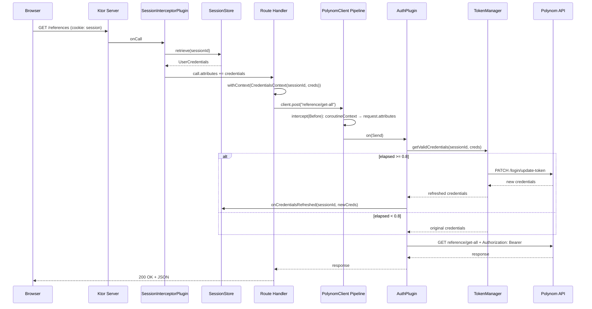

# Архитектура аутентификации и управления сессиями

## Обзор

Backend integration-studio выступает BFF-прослойкой между фронтендом и внешним Polynom API.
Аутентификация построена на JWT-токенах, которые выдает Polynom. Backend хранит токены в памяти,
проактивно обновляет их и прозрачно подставляет в исходящие запросы через систему плагинов Ktor.

---

## Структура модулей

```
ktor-server-app/                  — HTTP-сервер, сессии, роутинг
polynom-client/                   — HTTP-клиент к Polynom API, логика токенов
shared/
  integration-studio-common-models/ — UserCredentials, value-классы токенов
  integration-studio-transport-kmp/ — Transport DTO
  etl-mapper/                       — маппинг Domain <-> Transport
excel-service/                    — обработка Excel-файлов
```

Зависимости между модулями (в контексте аутентификации):

```
ktor-server-app  --->  polynom-client  --->  common-models
       |                                          ^
       +------------------------------------------+
```

`polynom-client` не знает о существовании `ktor-server-app`. Обратная связь реализована через callback.

---

## Модель данных

### UserCredentials (common-models)

Неизменяемый data class, хранящий полный набор авторизационных данных пользователя:

| Поле           | Тип           | Назначение                              |
|----------------|---------------|-----------------------------------------|
| `login`        | `Login`       | Логин пользователя                      |
| `storageId`    | `StorageId`   | Идентификатор хранилища                 |
| `accessToken`  | `AccessToken` | JWT access-токен для запросов к Polynom  |
| `refreshToken` | `RefreshToken` | Токен для обновления access-токена      |
| `issuedAt`     | `Long`        | Момент выдачи токена (epoch ms)         |
| `expiresAt`    | `Long`        | Момент истечения токена (epoch ms)      |

`Login`, `StorageId`, `AccessToken`, `RefreshToken` — value-классы с sentinel-значением `NONE`.

---

## Хранилище сессий (ktor-server-app)

### SessionStore / InMemorySessionStore

Интерфейс `SessionStore` определяет операции: `store`, `retrieve`, `updateCredentials`, `remove`, `cleanup`.

Реализация `InMemorySessionStore`:
- `ConcurrentHashMap<String, SessionEntry>`, где `SessionEntry` содержит `MutableStateFlow<UserCredentials>`
- Фоновая очистка каждые 60 секунд, удаляет сессии старше 7 дней

Почему `MutableStateFlow`: позволяет атомарно обновлять credentials при refresh токена
без блокировки чтения.

Почему in-memory: backend — однопроцессный BFF, персистентность сессий не требуется.

---

## Жизненный цикл токена (polynom-client)

### TokenManager

Управляет обновлением токенов. Ключевые решения:

**Per-session Mutex** — `ConcurrentHashMap<String, Mutex>`, ключ — `sessionId`.
Глобальный mutex блокировал бы запросы пользователя B на время refresh токена пользователя A.
Per-session mutex допускает параллельный refresh разных пользователей, но предотвращает
дублирование refresh для одного пользователя (double-check locking).

**Проактивный refresh на 80% времени жизни** — формула:

```
elapsed = (now - issuedAt) / (expiresAt - issuedAt)
needsRefresh = elapsed >= 0.8
```

Зачем: запросы к Polynom API не должны падать с 401 из-за истекшего токена.
Порог 80% (`AuthConfig.REFRESH_THRESHOLD`) дает запас до истечения.

**Метод refresh** — `performAuthentication()` отправляет `PATCH` на `/login/update-token`
с `refreshToken`, получает новые `UserCredentials` с актуальными `issuedAt`/`expiresAt`.

### AuthPlugin (Ktor client plugin)

Плагин HTTP-клиента, перехватывающий фазу `Send`:

1. Проверяет URL — пропускает без авторизации: `login/sign-in`, `storage-definitions`, `update-token`
2. Читает credentials из `request.attributes` (ключи `UserCredentialsAttrKey`, `SessionIdAttrKey`)
3. Если credentials отсутствуют — пропускает запрос без auth-заголовка
4. Вызывает `tokenManager.getValidCredentials()` — проактивный refresh при необходимости
5. Если credentials обновились — вызывает callback `onCredentialsRefreshed`
6. Устанавливает заголовок `Authorization: Bearer <token>`
7. При ответе 401 — принудительный `authenticate()`, callback, повтор запроса

**Исключение `update-token` из auth-проверки критично**: без него refresh-запрос рекурсивно
попадает в AuthPlugin, пытается обновить токен, и deadlock на per-session mutex.

Конфигурация: `baseUrl`, `tokenManager`, `onCredentialsRefreshed: suspend (sessionId, UserCredentials) -> Unit`.

---

## Передача credentials: CoroutineContext + request attributes

Это центральное архитектурное решение. Credentials передаются в два этапа:

```
Route handler                  PolynomClient pipeline           AuthPlugin (Send)
     |                                |                              |
     |  withContext(                   |                              |
     |    CredentialsContext(          |                              |
     |      sessionId, creds))        |                              |
     |                                |                              |
     +-----> coroutineContext          |                              |
             [CredentialsContext]      |                              |
                                      |                              |
          requestPipeline.intercept(Before):                         |
          читает CredentialsContext                                  |
          из currentCoroutineContext()                                |
          копирует в request.attributes                              |
                                      +---> attributes               |
                                            [UserCredentialsAttrKey] |
                                            [SessionIdAttrKey]       |
                                                                     |
                                                        on(Send):    |
                                                        читает из    |
                                                        request      |
                                                        .attributes  |
```

**Почему два этапа, а не один:**

Ktor client plugin (`on(Send)`) не имеет прямого доступа к coroutine context вызывающего кода.
Pipeline interceptor на фазе `Before` — имеет, потому что выполняется в coroutine context
вызывающего `client.post(...)`. Request attributes — надежный транспорт внутри клиентского pipeline,
доступный на всех последующих фазах.

**CredentialsContext** — элемент `AbstractCoroutineContextElement`, переносит `sessionId` и `UserCredentials`.

---

## Серверный перехватчик сессий (ktor-server-app)

### SessionInterceptorPlugin

Route-scoped плагин. Применяется только к защищенным маршрутам:

```kotlin
route("/") {
    install(SessionInterceptorPlugin) { sessionStore = config.sessionStore }
    get("/references") { ... }
    // ...другие защищенные эндпоинты
}
```

Логика `onCall`:
1. Извлекает `UserSession` из cookie
2. По `sessionId` получает `UserCredentials` из `SessionStore`
3. Кладет в `call.attributes` (`UserSessionKey`, `UserCredentialsKey`)
4. Если сессия или credentials отсутствуют — отвечает 401

Extension-свойства `call.userSession` и `call.userCredentials` обеспечивают типобезопасный доступ
в обработчиках маршрутов.

**Почему route-scoped, а не глобальный**: публичные эндпоинты (`/storage-definitions`, `/authorize`,
`/check-session`) находятся вне блока `route("/") { install(...) }` и не проходят проверку сессии.

---

## Связывание модулей (Application.kt)

```kotlin
val sessionStore = InMemorySessionStore()
val polynomClient = createSimpleBffClient(
    onCredentialsRefreshed = { sessionId, credentials ->
        sessionStore.updateCredentials(sessionId, credentials)
    }
)
```

Callback `onCredentialsRefreshed` — единственная точка связи между `polynom-client` и `ktor-server-app`.
Когда AuthPlugin обновляет токен, он вызывает callback, который обновляет credentials в SessionStore.
Следующий HTTP-запрос от того же пользователя получит актуальные credentials.

**Почему callback, а не прямая зависимость**: `polynom-client` — переиспользуемый модуль HTTP-клиента.
Прямая зависимость на `SessionStore` создала бы циклическую зависимость между модулями.

---

## Полный flow аутентифицированного запроса



---

## Публичные и защищенные эндпоинты

| Эндпоинт               | Тип       | Описание                        |
|-------------------------|-----------|---------------------------------|
| `/storage-definitions`  | Публичный | Список хранилищ (до авторизации)|
| `/authorize`            | Публичный | Вход (sign-in)                  |
| `/check-session`        | Публичный | Проверка валидности сессии      |
| `/upload`               | Публичный | Загрузка файлов                 |
| `/`                     | Публичный | Корневой эндпоинт               |
| `/references`           | Защищенный| Справочники из Polynom          |
| (другие внутри route)   | Защищенный| Все остальные бизнес-эндпоинты  |

---

## Решение об отсутствии PolynomService

Промежуточный слой `PolynomService` между роутингом и `PolynomClient` был удален.
После переноса логики аутентификации в плагины (AuthPlugin, SessionInterceptorPlugin)
сервисный слой стал trivial passthrough — каждый метод лишь делегировал вызов клиенту.
Обработчики маршрутов вызывают `polynomClient` напрямую, что сокращает стек вызовов
без потери разделения ответственности (auth — в плагинах, маппинг — в клиенте).